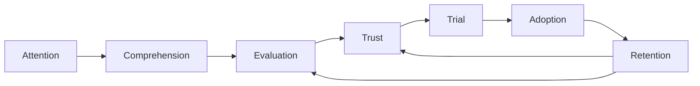

# Technology Marketing

**Read this before producing any marketing asset** — copy, video, imagery,
audio, or interactive demo. This hub routes to a set of guides that distill
adoption-psychology research into practical rules for marketing complex
professional technology — developer tools especially.

## The one idea everything else follows from

Technology adoption is not a single outcome that one clever message can win.
It is a **chain of partially separable outcomes**, and different psychological
mechanisms dominate at each link:

Early stages are moved by expected usefulness, relevance, source credibility,
and social signals. Actual use is moved by task fit, workflow integration, and
switching costs. Continued use is moved by whether real experience **confirms
the expectations your messaging set**. The single most common marketing error
is collapsing these stages — treating a favorable first impression, a click,
or a trial signup as evidence the same message will produce durable adoption.

Every asset should therefore answer three questions before it is produced:
*which stage of the ladder is this targeting?*, *which audience is making the
decision at that stage?*, and — once the medium is chosen — *what does the
evidence say about executing well in it?*

## The four load-bearing findings

1. **Task fit beats novelty.** People adopt tools that help them complete
   their next real task in their real environment, not tools that merely
   appear impressive. Messages that map to the reader's current stack, task,
   or pain outperform generic capability claims.
2. **Comprehension must adapt to expertise.** Novices need worked examples
   and structured guidance; experts experience the same material as noise.
   One onboarding narrative cannot serve both.
3. **Trust is performance-based and calibration-sensitive.** Users trust
   systems that are accurate enough, transparent enough, and easy to override
   when wrong. Badges and "trustworthy AI" language do little; visible
   performance, provenance, and cheap reversal do a lot.
4. **Retention is won by total workflow burden, not time-to-first-output.**
   Verification, compliance, waiting, and coordination costs decide whether a
   tool survives contact with real work. Messaging that overpromises here
   sets up the expectation-disconfirmation that kills continuance.

## Where to go

| You are about to… | Read | Why |
|---|---|---|
| Create a message for a specific funnel position (landing page, docs intro, onboarding email, renewal pitch) | [Marketing by Funnel Stage](./marketing-funnel-stages.md) | What mechanism dominates each stage, and what the message should do — and avoid — at each |
| Pitch to developers, an enterprise buying group, or end-users of a deployed system | [Marketing by Audience Segment](./marketing-audience-segments.md) | The evidence each stakeholder actually needs; why one undifferentiated story fails |
| Produce in a chosen medium — video, imagery, text, audio, or a demo — or reinforce a message in a second medium | [Executing in Your Medium](./marketing-medium-execution.md) | Production rules ranked by effect size; cross-media reinforcement without wear-out |
| Reach for a "psychology hack" (social proof, scarcity, loss framing, defaults…) | [Psychology Claims Audit](./marketing-psychology-claims.md) | Which popular claims replicate, which are conditional, and which are oversold — with sources |
| Start drafting or producing right now | [Marketing Message Checklist](./marketing-message-checklist.md) | The pre-production checklist and red-flag list; the fastest practical distillation of the other pages |

New here? Read this page, then skim [Marketing Message Checklist](./marketing-message-checklist.md); return to
the other pages when a checklist item needs its rationale.

## Standing anti-patterns

These recur throughout the guide; treat them as defaults to avoid:

- **Stage collapse** — citing intent-to-use signals (clicks, signups, survey
  enthusiasm) as proof of durable value, or writing retention messaging with
  attention-stage tactics.
- **Borrowed uplift numbers** — quoting a benchmark or a study's average gain
  as if it transfers to the reader's context. Productivity effects are highly
  context-dependent; invite measurement on the reader's own workflow instead.
- **Generic social proof** — "10,000 teams use X" without a reference group
  the reader identifies with. Norm effects are strong only when the group is
  specific and psychologically close.
- **Overpromising first impressions** — messaging that wins the demo but sets
  expectations real use will disconfirm. Expectation confirmation, not launch
  excitement, drives continuance.
- **One story for all stakeholders** — enterprise purchases are made by
  buying centers with conflicting evidence needs; a single narrative
  satisfies none of them.
- **Letting the medium do the persuading** — decoration, polish, and format
  ("we made a video") substituting for a task-anchored argument. The claim
  carries the message; the medium proves it.

## Sources

The research base for this guide, with full citations, lives in
[Psychology Claims Audit](./marketing-psychology-claims.md).
